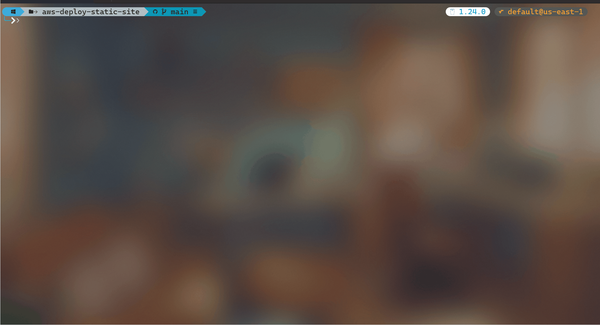

# AWS Static Site Deployment Tool

A Go-based CLI tool that automates the deployment of static websites to AWS using S3 and CloudFront.



## Prerequisites

- Go 1.24 or later
- AWS CLI configured with appropriate credentials
- AWS account with permissions to:
  - Create and manage S3 buckets
  - Create and manage CloudFront distributions
  - Create and manage IAM policies
  - Create Origin Access Control

## Installation

1. Clone the repository:

```bash
git clone https://github.com/youssefframy/aws-deploy-static-site.git
cd aws-deploy-static-site
```

2. Install dependencies:

```bash
go mod download
```

## Usage

1. Ensure your AWS credentials are configured either through:

   - AWS CLI (`aws configure`)
   - Environment variables (`AWS_ACCESS_KEY_ID` and `AWS_SECRET_ACCESS_KEY`)
   - IAM role (if running on AWS infrastructure)

2. Run the application:

```bash
go run main.go
```

3. Follow the interactive prompts:
   - Enter AWS profile name (optional, press Enter for default)
   - Enter S3 bucket name (required)
   - Enter local path to your website files (required)
   - Enter CloudFront distribution description (optional)
   - Enter AWS region (required, e.g., "us-east-1")

The tool will:

- Create an S3 bucket
- Configure the bucket for website hosting
- Create a CloudFront distribution
- Set up Origin Access Control
- Upload your website files
- Configure proper caching and security settings

## Output

Upon successful deployment, the tool will display:

- Bucket name
- Distribution ID
- CloudFront domain name (your website URL)

## Security Features

- S3 bucket is private by default
- CloudFront Origin Access Control (OAC) for secure S3 access
- HTTPS-only access through CloudFront
- Public access blocking on S3 bucket

## Notes

- The first deployment may take 10-15 minutes for CloudFront distribution to fully propagate
- Website files are cached with a default TTL of 1 year for optimal performance
- The tool handles SPA (Single Page Application) routing by redirecting 404s to index.html

## Troubleshooting

If you encounter issues:

1. Ensure AWS credentials have sufficient permissions
2. Verify the bucket name is globally unique
3. Check if the specified region supports all required services
4. Ensure the website folder path is correct and contains your static files
